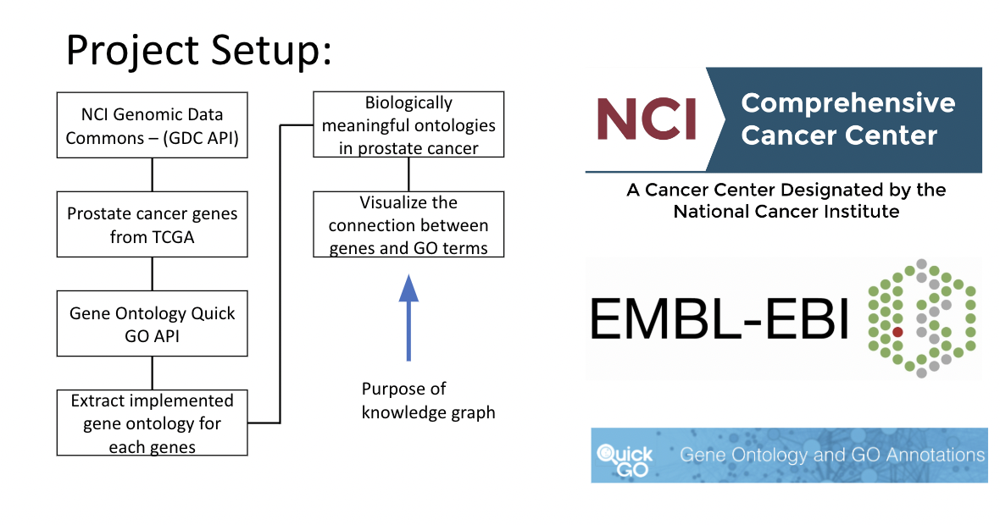
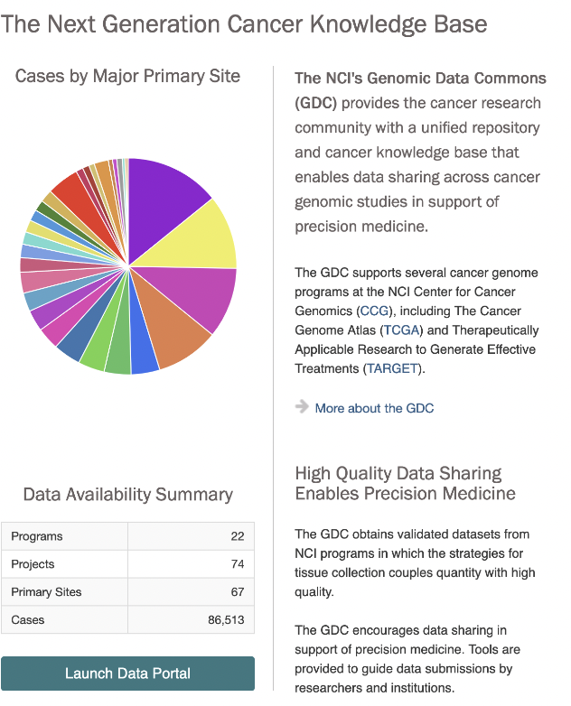
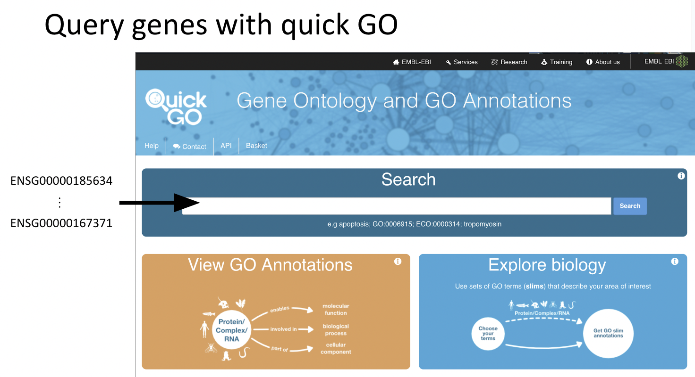
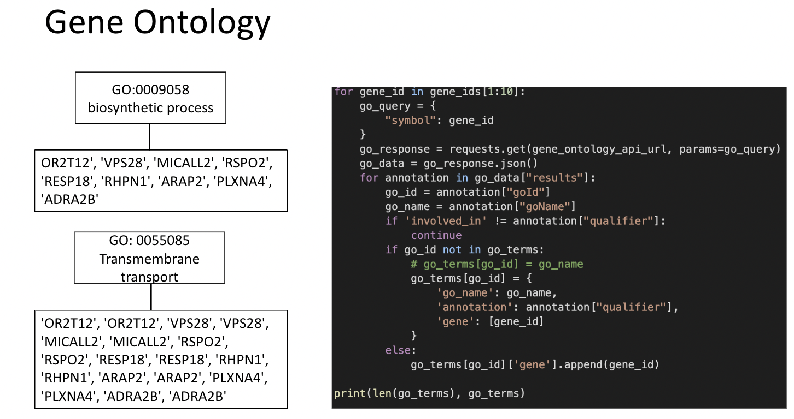
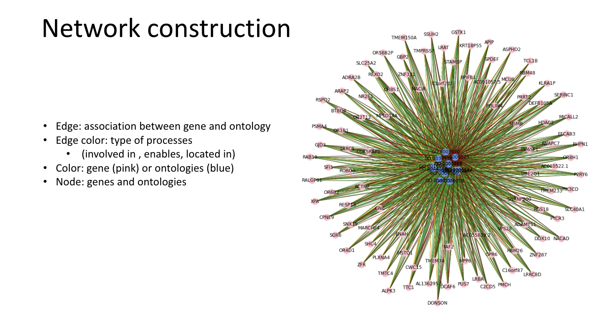

## Prostate Cancer Gene Ontology Analysis

Explored by: Helena Winata, Jieun Oh, Xinzhe Li 

### Description. 

### Query for NCI Cancer Knowledge Base

#### Query genes with quick GO

### Gene Ontology

#### Network

#### QUICK GO API:

- UniProt Consortium. (2023). QuickGO [online]. EMBL-EBI, European Bioinformatics Institute. https://www.ebi.ac.uk/QuickGO (accessed March 11, 2023)

#### GDC API:

- National Cancer Institute. Genomic Data Commons Data Portal API [online]. GDC Data Portal, National Cancer Institute. https://api.gdc.cancer.gov/ (accessed March 11, 2023)
