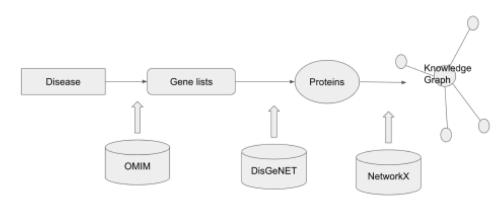
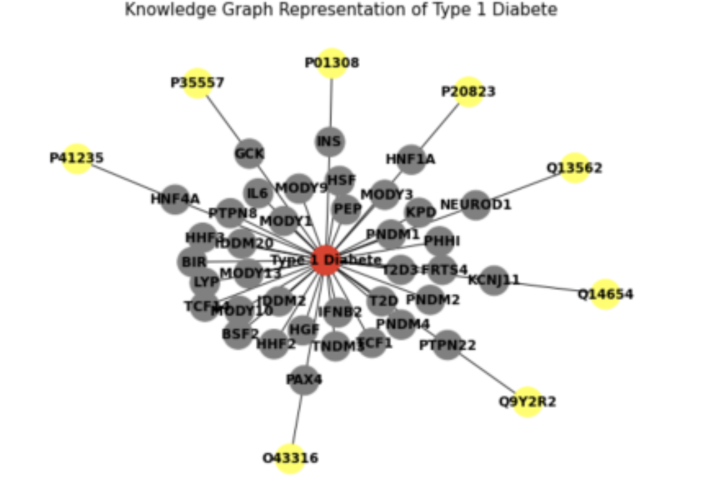

## Title: Knowledge Graph of Type 1 Diabetes

Explored by: Lapins Kasandra, Hucharlotte

### Description: 
Knowledge graph is a useful tool to organize biological findings and relationships between the bio-identities. It can be used in publication studies, research comparison and drug discoveries.

### Use Cases: 
Novel Drug Target Predictions: Type 1 Diabetes. Our aim is to find the known genes associated with a disease and furthermore, the proteins that are bound to these genes. 

### Workflow:

A disease name is used in OMIM API. The related gene list is generated from this step. Then we import the gene list into the DisGeNET database to find the uniprotein ID. Learning from this step, we are able to discover which protein complex is associated with this disease and which 
has not been linked to a protein complex. At the end, all the information will be constructed into a knowledge graph using a Python package, NetworkX. 

#### Schema: 

We are able to retrieve 37 genes that are related to Type 1 Diabetes disease. Only 8 proteins are found in the DisGeNET database based on the gene list.

#### Code Availability: 

### Tutorial: [Google Colab notebook is available here](https://colab.research.google.com/drive/1KtVqdxsEcVadtODIWjMZkyb HUYyfk1cA?usp=sharing)

