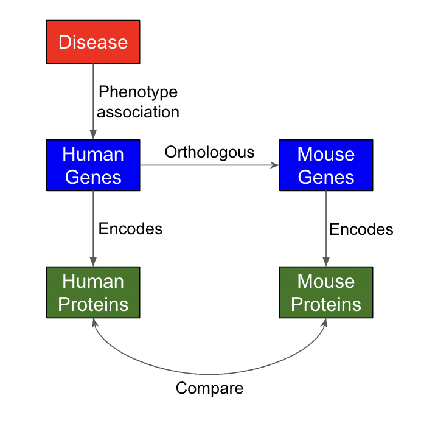
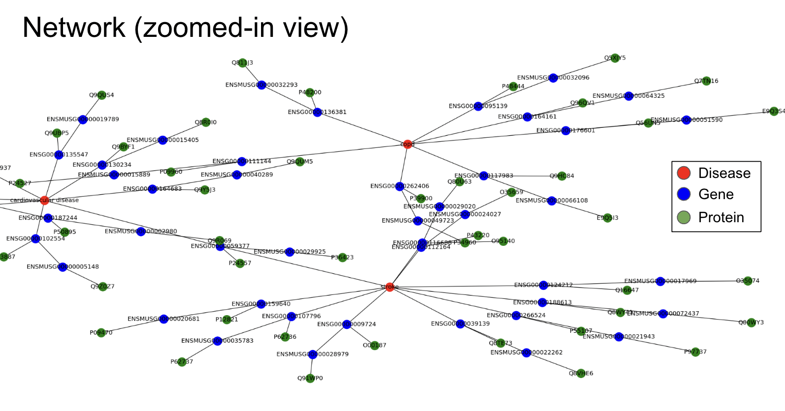
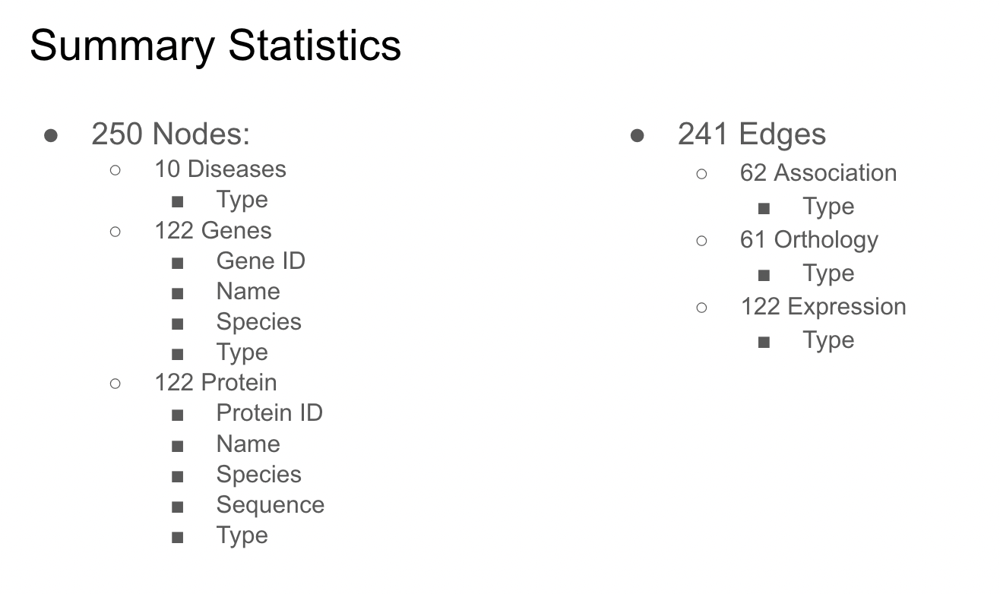

## Knowledge Graph for Comparing Disease-Gene Associations Across Species

Explored by: Francesco Musella, Alex Flynn-Carroll, Jack Dodson

### Description. 

### Use cases

- Disease → Find most conserved orthologous genes
 - Useful for translating results from mouse to human
 - Compare different similarity metrics
- Scan list of disease → find most “conserved” disease
- Find diseases that share common orthologs
 - Disease for which orthologous are the most similar
 - Useful for choosing disease to study

### APIs Used

- Mygene.info (disease to gene)
- Ensembl (homology)
- UniProt (gene to protein)
- Diseases included
    - Bipolar disorder
    - High blood pressure
    - Cardiovascular disease
    - Rheumatoid arthritis
    - Anxiety disorder
    - Sickle cell
    - Arrhythmia
    - CAD
    - COPD
    - Stroke

#### Network (zoomed-in view)

#### Summary Statistics

### Future Directions

- Additional information to add:
    - More genes
        - Add a wider range of API’s
        - Include less established associations (GWAS Catalog)
    - More proteins
    - Wider range of diseases
    - Different species
- Add biological pathways as nodes
- Develop more robust similarity metrics
