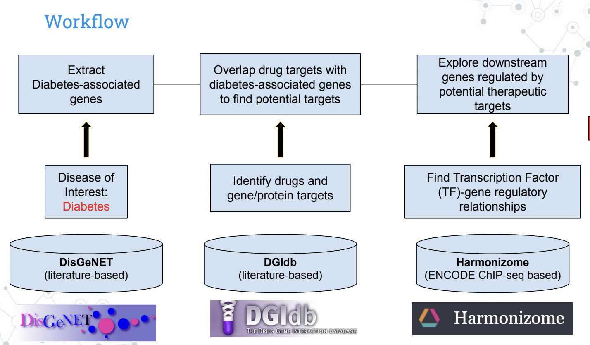
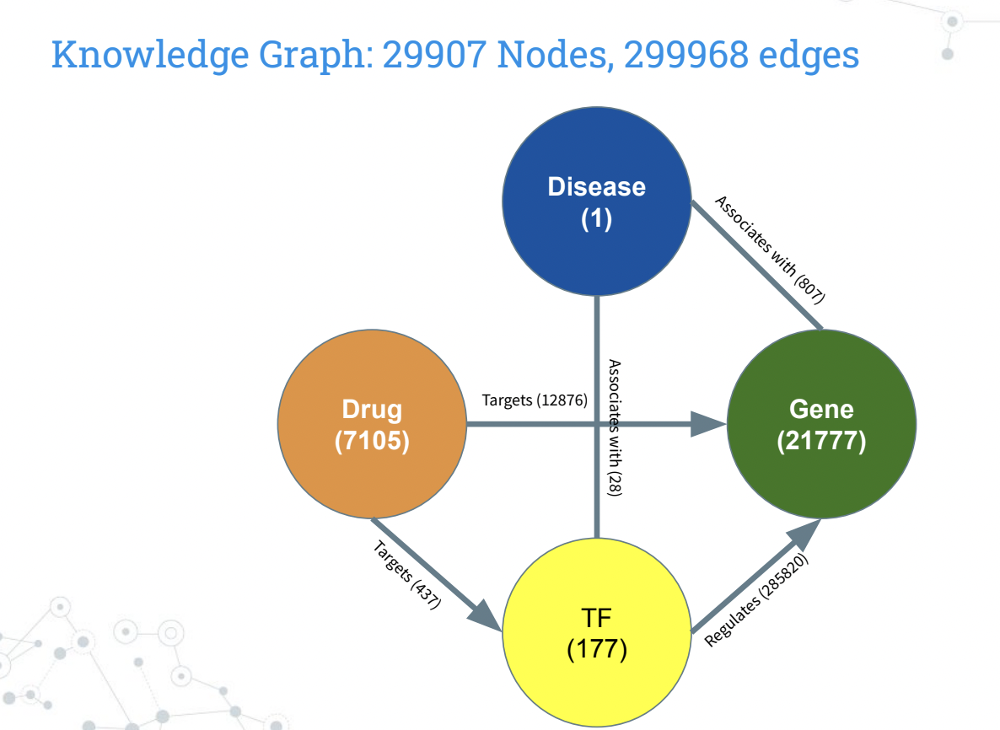
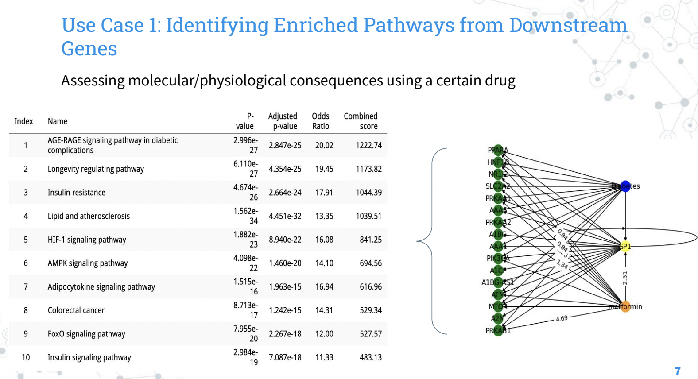
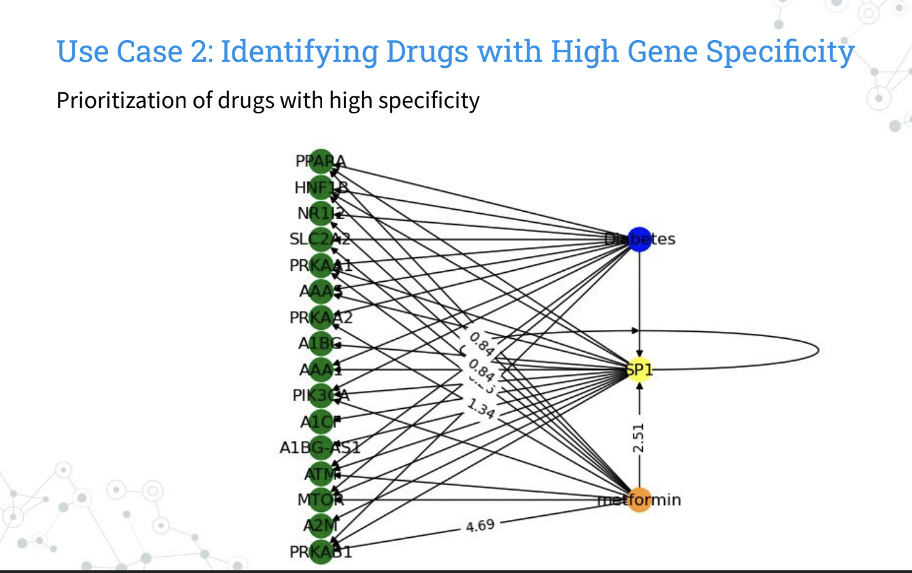

## Knowledge Graph to Visualize Potential Downstream Effects of Drug Repositioning

Explored by: Pancho Alvarex, Michael Cheng

### Description. 

Drug repositioning has gained interest in recent translational research. However, the repurposing of a drug may contain adverse physiological effects. Therefore, testing the efficacy and downstream consequences of drug repurposing is necessary but also demands great experimental financial costs. We designed a knowledge graph by leveraging various public databases, including DisGeNET, Drug-Gene Interaction Database, and Harmonizome, to screen the broad transcriptional and ontological repercussions of drug repositioning to facilitate search of new therapies. 

### Databases

Drug repositioning has gained interest in recent translational research. However, the repurposing of a drug may contain adverse physiological effects. Therefore, testing the efficacy and downstream consequences of drug repurposing is necessary but also demands great experimental financial costs. We designed a knowledge graph by leveraging various public databases, including DisGeNET, Drug-Gene Interaction Database, and Harmonizome, to screen the broad transcriptional and ontological repercussions of drug repositioning to facilitate search of new therapies. 

# Knowledge Graph: 

Our knowledge graph combines relationships from 
DisGeNET, DGIdb, and Harmonizome to visualize the 
downstream transcriptional effects of drug repositioning 
for our disease of interest, in this case diabetes. Our 
schema describes the associations between each node 
entity. Our graph contains 29907 total nodes and 299968 
edges. There is 1 Disease node, 7105 Drug nodes, 21777 
gene nodes, and 177 transcription factor (TF) nodes. 
Each node contains attributes Name, Type, and Color to 
distinguish them as unique entities. There are five 
different types of edge relationships. Connections 
between Disease and Transcription Factor (TF), of which 
our graph contains 23 edges, explain that a TF 
“associates with” a disease. Similarly, Disease-gene 
connections communicate that a gene “associates with” 
a disease, and we observe 807 such relationships in our 
graph. Furthermore, 437 edges connect Drug to TF, which means that a drug “targets” a TF. Edges where a drug “targets” a gene are seen 12876 times in our graph as Drug-Gene node connections. Lastly, the majority of edges in our graph, 285820 to be precise, are between TF and Gene, which suggests that a TF “regulates” a gene. Each edge contains 2 attributes. The weight of the edge is determined by the weight or score given by the corresponding database, gene-disease association for Disease-TF/Gene, Drug-Gene Interaction score for Drug-TF/Gene, and positive or negative regulation for TF-Gene. The association type of the edge is the description of the relationship that we previously defined. 

### Use Cases 

1. Drug Prioritization: Identify drugs with high specificity for targeting a disease-associated gene. With our knowledge graph we identify drugs with high gene specificity based on the drug gene interaction
score from DGIdb to minimize the off-target binding that may lead to poor drug efficacy. This will help researchers prioritize drugs with high specificity when repurposing a drug for another disease. The figure below shows a subset of our knowledge graph, as well as interaction scores with a known diabetes drug metformin with its target genes. We listed interaction scores above 0.1, and this value can be tuned for the user’s needs. 

2. Drug Repercussions: Identify affected pathways 
downstream of a drug target. Another use of our 
knowledge graph is to explore pathways of genes 
downstream of a drug target. This can help 
researchers identify novel and adverse effects and 
risks of drug repositioning, thus facilitating their 
assessment of drug candidacy. We took downstream 
genes of metformin target SP1 that overlap with 
diabetes-associated genes and conducted pathway 
enrichment using EnrichR and KEGG pathway 
database. As expected, we identified insulin-related 
pathways but we also observed metabolic and 
lipid-metabolic pathways, as depicted in the table 
below. We see some consequences of metformin on biological pathways other than the desired insulin-related pathways. These findings are also consistent with recent research. Studies have shown that these novel lipid-metabolic effects suggest that metformin can be repurposed for weight loss. While the use of metformin for weight loss is considered off-label and not approved by the FDA, some studies have suggested that it may be effective in promoting weight loss in certain populations, particularly those with obesity and insulin resistance. Our knowledge graph’s ability to capture these effects demonstrates its utility for drug repositioning research.

### Tutorial: [Google Colab notebook is available here](https://drive.google.com/file/d/1QBNDwiMt7LybO_wV6D86w1m_056zfYD-/view?usp=sharing)