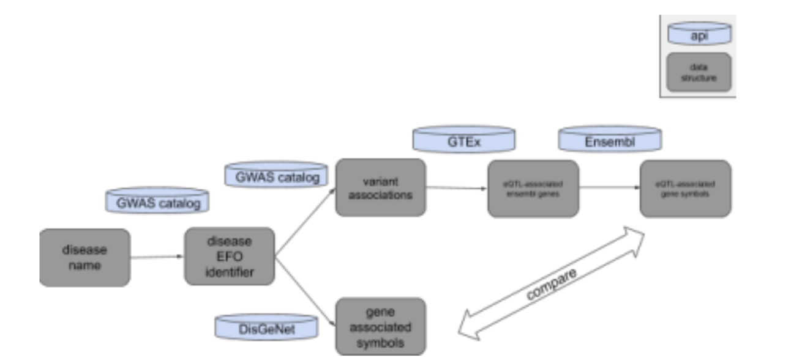
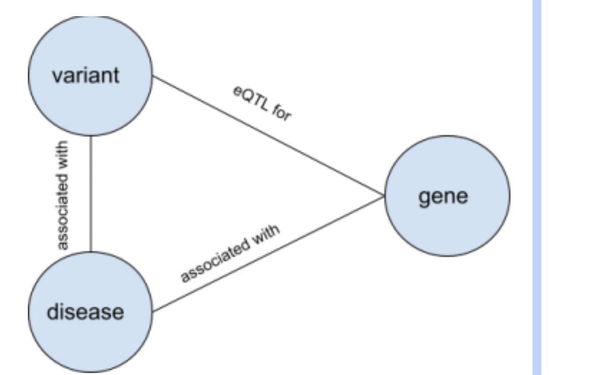
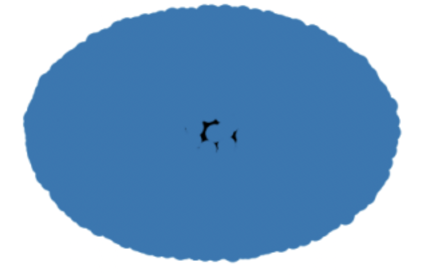

## Title: Assessing the overlap between gene associations and variant-associated eGenes 

Explored by: ```Terence Li, Aditya Pimplaskar, Sandy Kim ```

### Description: 
For a given disease, what is the overlap between genes associated with the disease through traditional gene-disease associations vs. genes associated with the disease by way of QTLs? Can we gain more information looking at genes associated with the disease by way of QTLs? 


### Use Cases: 
For our investigation, we look at the disease “ulcerative colitis”. 

### Workflow:

The biomedical databases/APIs we will be using are GWAS Catalog, GTEx, Ensembl, and DisGeNet. 
GWAS catalog allows us to extract variant associations from GWAS with a disease of choice. In addition, it allows us to extract the disease EFO identifier from the disease name. GTEx allows us to extract eGenes from those GWAS variants. Ensembl allows us to convert ENS gene identifiers to gene symbols. DisGeNet allows us to extract gene associations with a disease of choice. With all this information, we take the gene associations from DisGeNet and GWAS Catalog + GTEx and seethe overlap and if any more new information can be gained from using eQTLs.

#### Schema:


For disease “ulcerative colitis”: 



(Sorry, there were so many nodes and edges that the network is indiscernible.) 
2009 nodes (1 disease, 20 variants, 1989 genes) 
2388 edges (20 disease-variant, 400 variant-egene, 1964 disease-disease-associated gene, 4 disease-egene) 
Therefore, using eQTLs, we were able to find 4 more disease-associated genes! 


#### Code Availability: 

### Tutorial: 
[Google Colab notebook is available here](https://colab.research.google.com/drive/10QEFjPzxYmpnmNOkDt-t8S5PvlwsbZ8k?usp= sharing)


