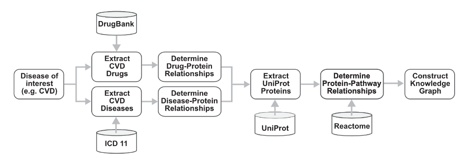
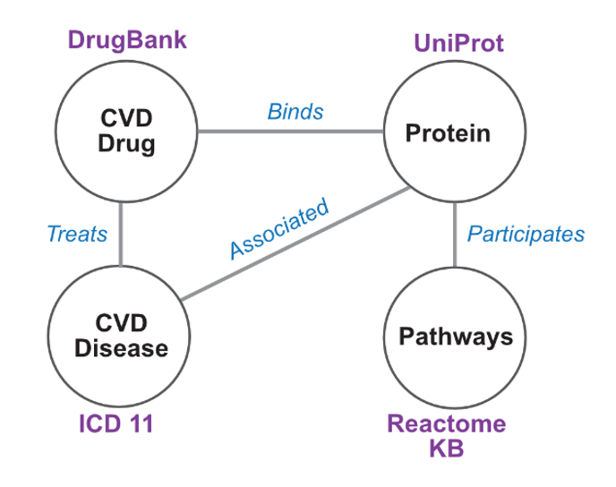

# Knowledge Graph Catalog

Welcome to the Knowledge Graph Catalog!

A knowledge graph is a hybrid of a traditional relational database and a graph. It consists of a set of concepts and the relationships among them. In biomedicine, knowledge graphs can be a powerful tool for organizing and interpreting complex biological systems, diseases, and their relationships with genes, proteins, and drugs, enabling more informed decision-making and the development of new treatments and therapies. For example, knowledge graphs can be leveraged for personalized medicine by representing attributes of a patient (e.g., patient's medical history, genetic information, and other relevant data) to tailor treatment plans to the individual patient. In biomedical research, knowledge graphs – consisting of the relationships among biomolecules, functions, and system phenotypes – enable investigators to gain a better understanding of how these systems work and how they may be disrupted in disease states.

Knowledge graphs are constructed with a specific purpose, for example, to predict interactions among proteins, biological processes associated with biomolecules, or manifestation of pathology that may be treated by drugs. All relevant data must be curated before performing analyses, analyses such as path-walking methods or machine learning approaches (e.g., link prediction with graph neural networks). 

These Knowledge Graphs were developed as part of the class projects from UCLA Bioinformatics 201 Winter 2023 and as hands-on projects from Bridge2AI ENABLE Scholar Program.

Each knowledge graph must include:
- Title
- Description
- Use Cases
- Workflow
- Schema

## A Sample KG Project

Following is a sample knowledge graph class project prepared by instructors. We encourage students to follow the similar pattern and add more information.

-----------

### Title: A comprehensive knowledge graph of cardiovascular drugs, diseases, proteins, and pathways

#### Description: 

Knowledge Graphs can link diverse sets of data and facts, reveal new relationships, and suggest mechanisms for further study. In this project, various data sets (cardiovascular drugs, diseases, proteins, and pathways) are extracted from biomedical databases and systematically integrated into the Knowledge Graph (KG). In the first place, integrated KG assists in the advanced search and implementation of graph algorithms for underpinning hidden relationships. Next, KG becomes the underlying infrastructure for developing advanced graph-based machine learning (e.g., Graph Neural Network (GNN), Heterogeneous Graph Transformer (HGT)) for link prediction between entities.

#### Use cases:

Use Cases:
1. Novel drug target prediction: Using the knowledge graph to explore the relationship between a cardiovascular disease (CVD) and drugs linked to protein drug targets, which may share multiple biological pathways with many proteins, to help identify potential novel drug targets.

2. Drug repurposing: Find potential new uses of existing drugs by linking drugs with other disease phenotypes that are not currently designated for the drug by examining the complex subgraph of a graph network.

#### Workflow: 

An example of a workflow for Use Case 1 Novel drug target prediction. First, a disease of interest is determined. Associated drugs and disease identifiers are curated from DrugBank and ICD11, respectively. The relationship between these drugs and diseases are extracted from UniProt and other prospective databases. Finally, UniProt identifiers are extracted from UniProt to determine pathways in which these proteins play a functional role from Reactome. These data in total are used to construct a knowledge graph.

#### Schema: 

An example of a Knowledge Graph Schema for Use Case 1 Novel drug target prediction. A schema of the knowledge graph, consisting of all four node types and their relationships are depicted. Biomedical resources are detailed adjacent to the node.

---------

Brought to you by **Ping Lab Utils (GitHub), UCLA, 2023**