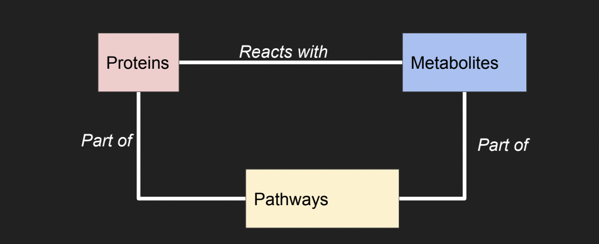
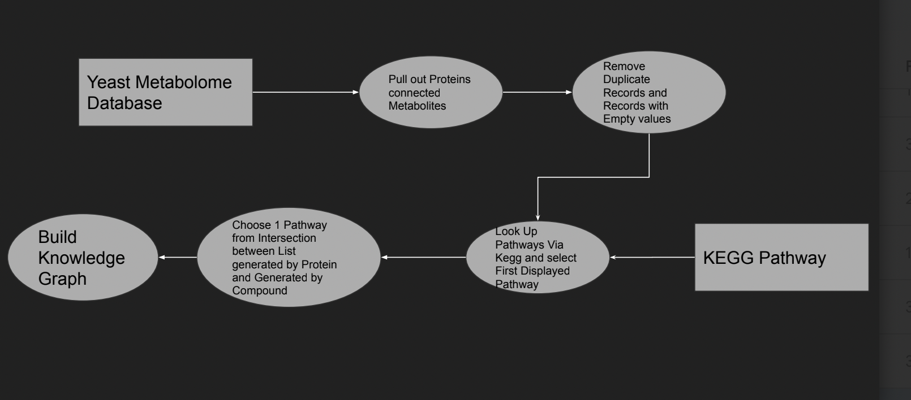

## Minimum Metabolic Pathways  with the Yeast Metabolome 

Explored by: Timothy Hamilton, Maria Flores

### Motivation 

1. Yeast is a model organism for development and evolution due to its unique  Evolutionary history 
2. It’s metabolism has analogous steps to most Eukaryotes ● Used to determine what is needed to make “minimally viable cell” ○ What are the minimum number of pathways needed and inputs given for cell to display the  qualities of life

### Knowledge Graph 

Represent the metabolic functions and inputs present in Yeast to determine  distinct groupings  

### Sources: Yeast Metabolic Database and Kegg Pathway  

 

### Workflow 

  

### Summary Statistics 

 

### Tutorial: [Google Colab notebook is available here](https://drive.google.com/file/d/1QBNDwiMt7LybO_wV6D86w1m_056zfYD-/view?usp=sharing)

### Issues and Further Steps. 

- Duplicate and Missing Records in Yeast Metabolome 
    - Largely due to lack support and obsolete Data (Group that created database moved on to  humans) 
    - Duplicate records means number of records severely over inflated 
    - Requires data to be published first 
- Multiple pathways given when looking up a particular Protein or metabolite ○ Choose the first 1 displayed, but this results in bias 
    - Combined with issue 1, limits utility of knowledge graphs, underscoring need for homologation  ● Further work 
    - Include specific reactions to help narrow down which pathways per protein-Metabolite pair ○ Apply more formal graph theoretical approaches to analyze the data 
- Weighted graphs to measure uncertainty?
